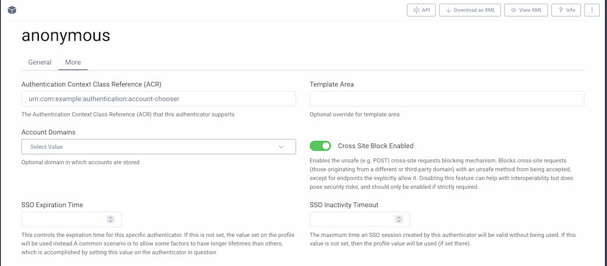

# AccountChooser Authentication Action Plugin

An authentication action plugin for the Curity Identity Server that allows the user to log in with one of the previously logged in accounts.

## Building the Plugin

You can build the plugin by issuing the command ``mvn package``. This will produce a JAR file in the ``target`` directory,
which can be installed.

## Installing the Plugin

To install the plugin, copy the compiled JAR into the :file:`${IDSVR_HOME}/usr/share/plugins/acountchooser`
on each node, including the admin node. For more information about installing plugins, refer to the [plugins docs](https://curity.io/docs/idsvr/latest/developer-guide/plugins/index.html#plugin-installation).

## Configuring the Plugin

To start using the plugin, first create an authenticator that will serve as a gateway to the action. It's recommended to use the [anonymous authenticator](https://github.com/curityio/anonymous-authenticator) for this purpose. Then create the choose account action and assign it to both the login and SSO flows of the anonymous authenticator.

The plugin needs a list of authenticator ACRs. This will be the authenticators that can be used to choose an already authenticated account. This list is presented at the end of the account chooser, so that the user can log in with another account using one of the listed authenticators. This list is also used when the user does not have any active SSO session yet.

### Note on The Gateway Authenticator

The choose account action can be applied to any authenticator, but the anonymous authenticator is recommended. If the action is applied to any other authenticator (essentially becoming a two-factor authentication), then additional checks would have to be made to verify that the subject chosen with this action actually corresponds to the subject from the parent authenticator. Currently, this action does not perform such checks.

The action does replace the subject assigned by the anonymous authenticator (either the static or the random one) with the subject obtained from the SSO session chosen by the user.

If the action is used in an OIDC flow, the resulting ID token will contain the `acr` claim with the ACR value of the anonymous authenticator. It is thus recommended to set this value to a more meaningful one — e.g., `urn:com:example:authentication:account-chooser`. To change the default ACR using the admin UI, go to your authentication profile then **Authenticators**. Edit the anonymous authenticator and switch to the **More** tab

## More Information

Please visit [curity.io](https://curity.io/) for more information about the Curity Identity Server.

